# User Documentation

## Installation
- Download latest module version from [distributions](../dist/)
- Move downloaded zip archive to the root of your Magento install
- unzip archive and run these commands at the root of your Magento install:
- `php bin/magento module:enable TransactPro_MagentoPluginGW3`
- `php bin/magento setup:upgrade`

## Initial configuration
- Enable and configure module in Magento admin (`Stores > Configuration > Payment Methods > TransactPro`) 
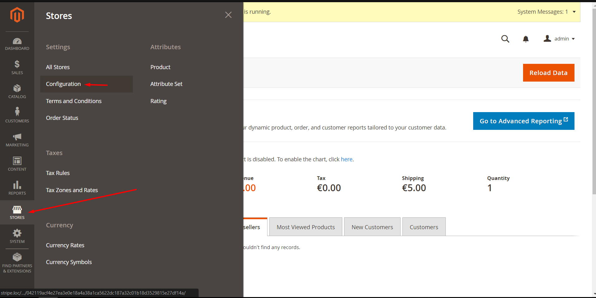
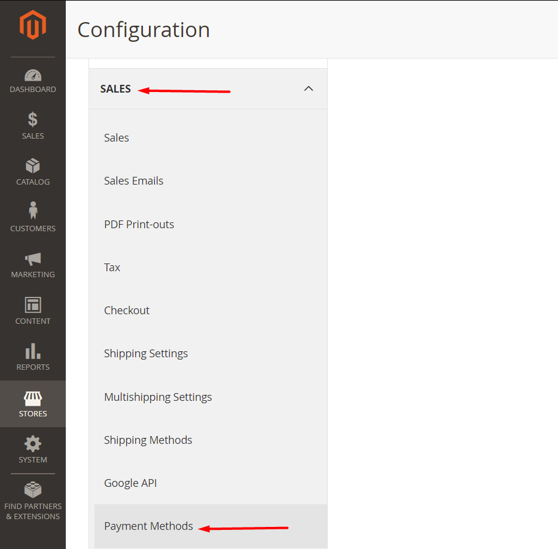

### Payment settings
- `Enabled`: Yes/No - Enables or disables Transact Pro module
- `Payment Action`: Authorize only / Authorize and Capture - depends from `Account ID`, you need to set corresponded `Account ID` value for correct work.
- `Payment Method`: Choose payment method you want to use (`SMS` is most common used)
  Supported methods are:
    - SMS: Customer will charged immediately, transaction can be reverted manually
    - DMS: Funds will be reserved, merchant can charge them or cancel manually
    - Credit: Funds will be transferred to merchant's credit card
    - P2P: Funds will be transferred to merchant's credit card using P2P method

- `New Order Status`: Choose `Processing`
- `Show Credit Card Form?`: Choose `Yes` (credit card details will be entered on `Checkout` page) or `No` (client will be redirected to payment gateway page to enter credit card details). 
- `Test Mode`: - Choose `Yes` for sandbox mode
- `Callback URL`: - You can not change that, this information is needed for Transact Pro support team to properly configure your account
- `Redirect URL (Return Url)`: - You can not change that, this information is needed for Transact Pro support team to properly configure your account
- `Account ID`: - Specify your numeric Account ID received from the Transact Pro support team, the specific Account ID is related the whay payments being processed
- `P2P Recipient Name`: - Specify your full name (First Name Last Name)
- `P2P Recipient Birth date`: - Specify your birth date (dd.mm.yyyy)
- `Live/Test Secret Key`: - Specify your Secret Key received from the Transact Pro support team 
- `Accepted Currency`: - Select Euro (The Transact Pro gateway currently operates with Euro only!)
- `Credit Card Verification`: - Select Yes

  **Note:** `Payment Action` depends from `Account ID`, you need to set corresponded `Account ID` value for correct work.
  For example, you have following Account ID values:
    - 100: CARD DETAILS COLLECTED ON GW SIDE_3D_V     - That means Security 3D transactions, customer will be redirected to payment gateway to enter credit card information, you need to set `Payment Action` as `Authorize only` 
    - 101: CARD DETAILS COLLECTED ON GW SIDE_NON 3D_V - That means non-3D transactions, customer will be redirected to payment gateway to enter credit card information, you need to set `Payment Action` as `Authorize only` 
    - 200: CARD DETAILS COLLECTED ON API_3D_V         - That means Security 3D transactions, customer will enter credit card information directly on Checkout page, you need to set `Payment Action` as `Authorize only` 
    - 201: CARD DETAILS COLLECTED ON API_NON3D_V      - That means non-3D transactions, customer will enter credit card information directly on Checkout page, if your `Payment Method = DMS` you need to set `Payment Action` as `Authorize only` otherwise set `Payment Action` as `Authorize and Capture`
- `Minimum/Maximum Order Total`, `Applicable/Specific Countries`: Conditions when that payment method can be used
- `Sort Order`: The position of that payment method in the payments options list on Checkout page

### Global settings

The Transact Pro gateway currently operates with Euro only! Please, configure your Magento instance to operate Euro by default (`Stores > Configuration > Currency Setup`): 

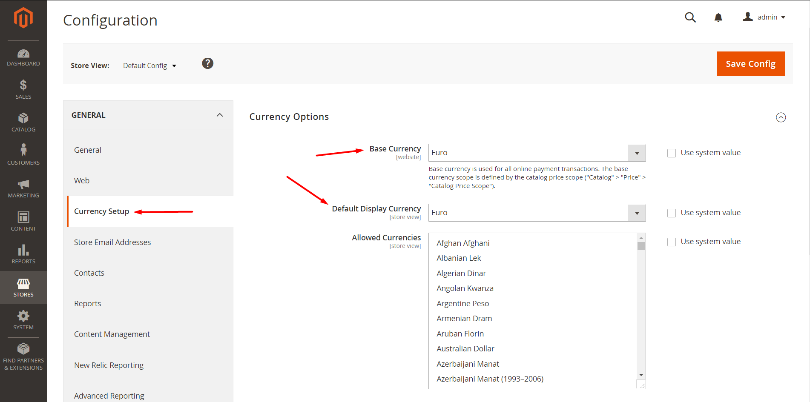

## Transaction handling

### Executing transaction

Choose Payment Method as `TransactPro` and fill card details (depends from the `Payment Method` and `Show Credit Card Form?` settings)

- directly on Checkout page: 
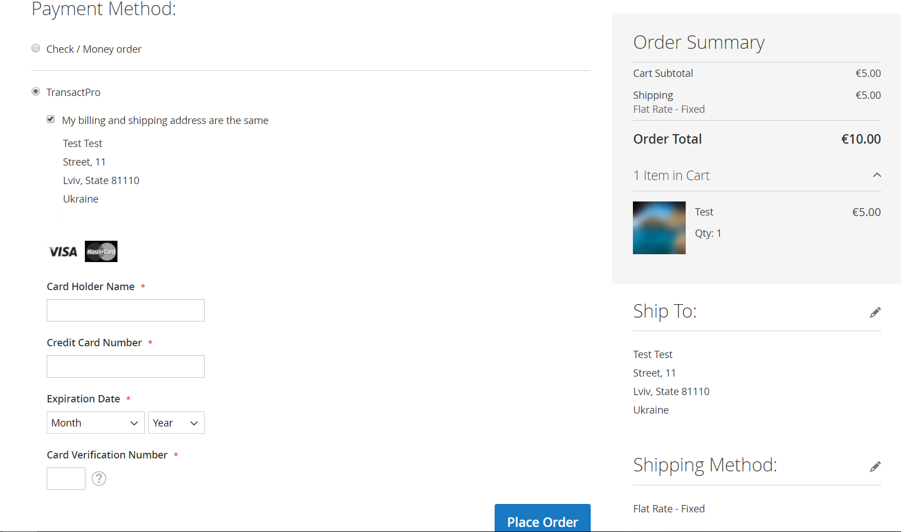

- or Payment Gateway page (After Place Order):

### Merchant

#### Orders

##### Order details

Click `View` button for the corresponded order

##### Accept or Deny payment

If you are using DMS `Payment method` you can Accept or Deny payment for order.
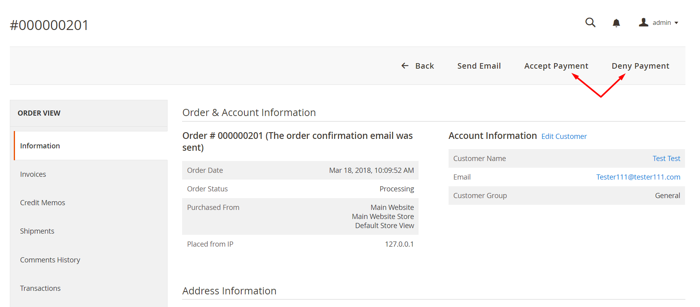

Accept payment:
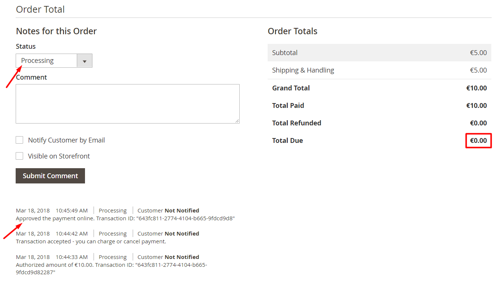

Deny payment:
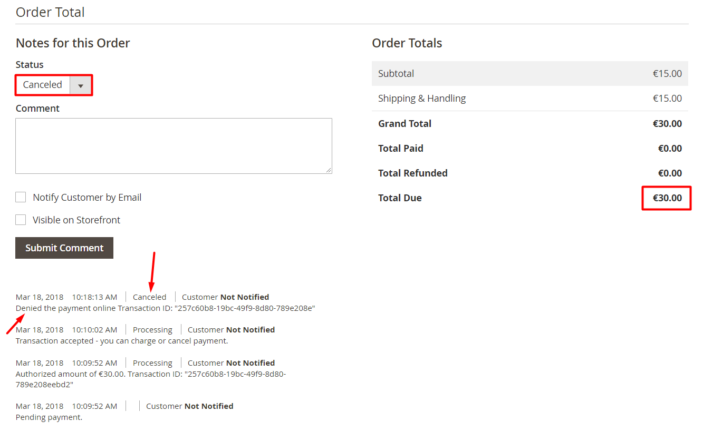

##### Refund order

You can refund orders with status `processing` (after successful payment)

Open `Invoices` tab and select paid invoice:
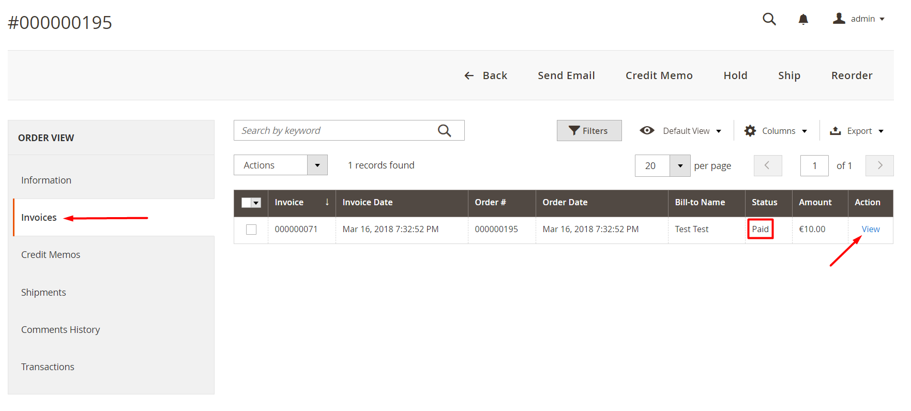

Create credit memo:
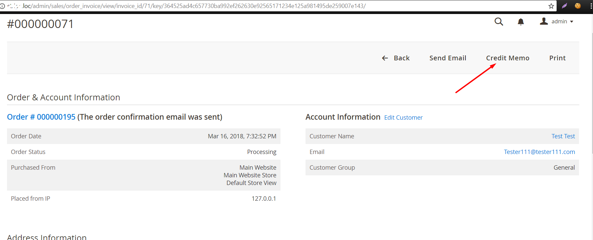
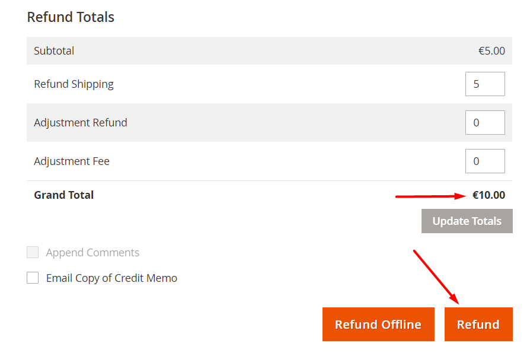
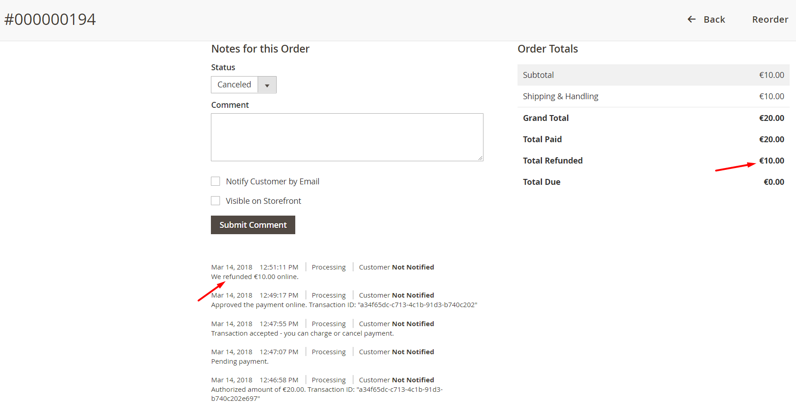

